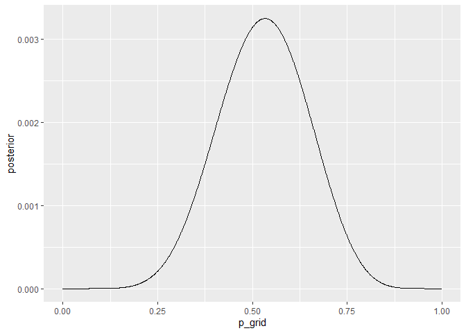
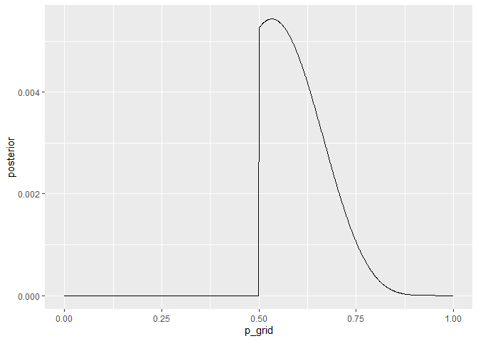

chp3
================
Vasco Brazão
12/5/2020

## Packages

``` r
library(tidyverse)
```

    ## -- Attaching packages --------------------------------------- tidyverse 1.3.0 --

    ## v ggplot2 3.3.2     v purrr   0.3.4
    ## v tibble  3.0.4     v dplyr   1.0.2
    ## v tidyr   1.1.2     v stringr 1.4.0
    ## v readr   1.4.0     v forcats 0.5.0

    ## -- Conflicts ------------------------------------------ tidyverse_conflicts() --
    ## x dplyr::filter() masks stats::filter()
    ## x dplyr::lag()    masks stats::lag()

``` r
library(rethinking)
```

    ## Loading required package: rstan

    ## Loading required package: StanHeaders

    ## rstan (Version 2.21.2, GitRev: 2e1f913d3ca3)

    ## For execution on a local, multicore CPU with excess RAM we recommend calling
    ## options(mc.cores = parallel::detectCores()).
    ## To avoid recompilation of unchanged Stan programs, we recommend calling
    ## rstan_options(auto_write = TRUE)

    ## Do not specify '-march=native' in 'LOCAL_CPPFLAGS' or a Makevars file

    ## 
    ## Attaching package: 'rstan'

    ## The following object is masked from 'package:tidyr':
    ## 
    ##     extract

    ## Loading required package: parallel

    ## rethinking (Version 2.13)

    ## 
    ## Attaching package: 'rethinking'

    ## The following object is masked from 'package:purrr':
    ## 
    ##     map

    ## The following object is masked from 'package:stats':
    ## 
    ##     rstudent

Code for the easy problems (from book):

``` r
p_grid <- seq( from=0 , to=1 , length.out=1000 )
prior <- rep( 1 , 1000 )
likelihood <- dbinom( 6 , size=9 , prob=p_grid )
posterior <- likelihood * prior
posterior <- posterior / sum(posterior)

set.seed(100)

samples <- sample(p_grid, prob = posterior, size = 1e4, replace = TRUE)
```

## 3E1

``` r
sum(samples < .2) / length(samples)
```

    ## [1] 4e-04

## 3E2

``` r
sum(samples > .8) / length(samples)
```

    ## [1] 0.1116

## 3E3

``` r
(sum(samples > .2) - sum(samples >= .8))/ length(samples)
```

    ## [1] 0.888

## 3E4

``` r
quantile(samples, .2)
```

    ##       20% 
    ## 0.5185185

## 3E5

``` r
quantile(samples, .8)
```

    ##       80% 
    ## 0.7557558

## 3E6

``` r
rethinking::HPDI(samples, .66)
```

    ##     |0.66     0.66| 
    ## 0.5085085 0.7737738

## 3E7

``` r
rethinking::PI(samples, .66)
```

    ##       17%       83% 
    ## 0.5025025 0.7697698

## 3M1

This time trying to be a little more tidyverse-y

``` r
globe <- tibble(
  p_grid = seq(from = 0, to = 1, length.out = 1000),
  prior = rep(1, 1000),
  likelihood = dbinom(8, size = 15, prob = p_grid),
  posterior = likelihood * prior / sum(likelihood * prior)
)

#a graph for good measure

globe3m1post <- globe %>%
  ggplot(aes(x = p_grid, y = posterior)) +
  geom_line()

print(globe3m1post)
```

<!-- -->

## 3M2

``` r
set.seed(100)

samples <- sample(globe$p_grid, prob = globe$posterior, size = 1e4, replace = TRUE)

rethinking::HPDI(samples, .90)
```

    ##      |0.9      0.9| 
    ## 0.3343343 0.7217217

## 3M3

``` r
w <- rbinom(1e4, size = 15, prob=samples)

# probability of 8 W
sum(w == 8)/1e4
```

    ## [1] 0.1499

## 3M4

``` r
new_w <- rbinom(1e4, size = 9, prob = samples)

# probability of 6 w
sum(new_w == 6)/1e4
```

    ## [1] 0.1842

## 3M5

``` r
# first, we create the data again
globe_new <- tibble(
  p_grid = seq(from = 0, to = 1, length.out = 1000),
  prior = ifelse(p_grid >= .5, 1, 0),
  likelihood = dbinom(8, size = 15, prob = p_grid),
  posterior = likelihood * prior / sum(likelihood * prior)
)

# graph

globe3m5post <- globe_new %>%
  ggplot(aes(x = p_grid, y = posterior)) +
  geom_line()

print(globe3m5post)
```

<!-- --> To calculate de hpdi

``` r
set.seed(100)

samples <- sample(globe_new$p_grid, prob = globe_new$posterior, size = 1e4, replace = TRUE)

rethinking::HPDI(samples, .90)
```

    ##      |0.9      0.9| 
    ## 0.5005005 0.7097097

We can see it is quite a bit narrower, and now confidently excludes
values below .5. The upper bound did not shrink by a lot though.

For the posterior predictive check: what does our model think is the
probability of observing 8 waters in 15 tosses?

``` r
w <- rbinom(1e4, size = 15, prob = samples)

# probability of 8 W
sum(w == 8)/1e4
```

    ## [1] 0.163

It is a little higher than before.

Now for 6 waters in 9 tosses.

``` r
new_w <- rbinom(1e4, size = 9, prob = samples)

# probability of 6 w
sum(new_w == 6)/1e4
```

    ## [1] 0.2353

It is a little lower than before.
