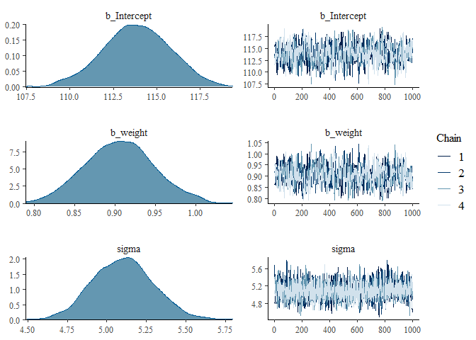
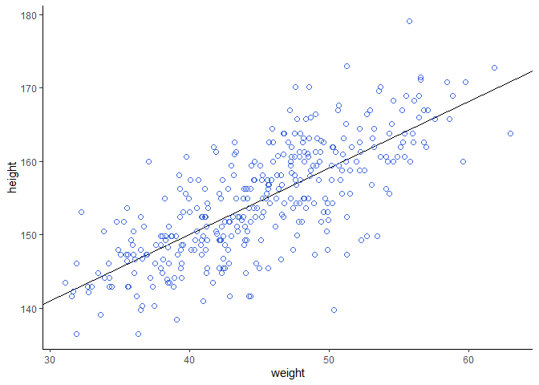
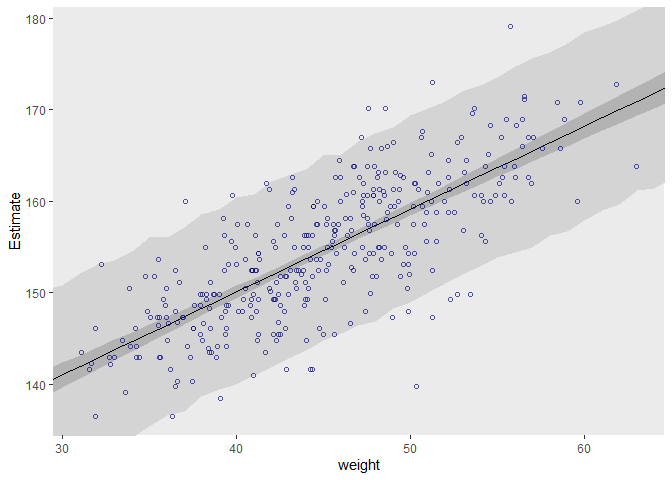
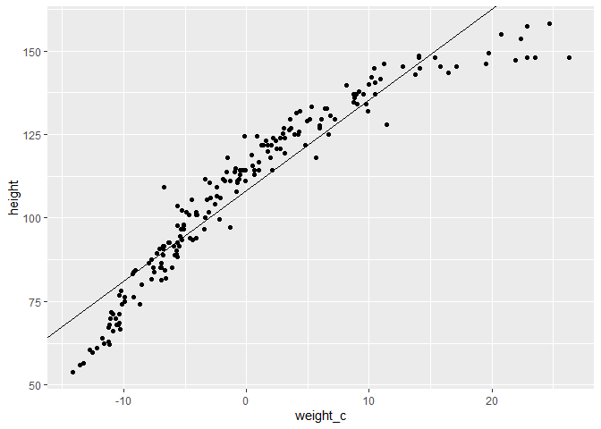
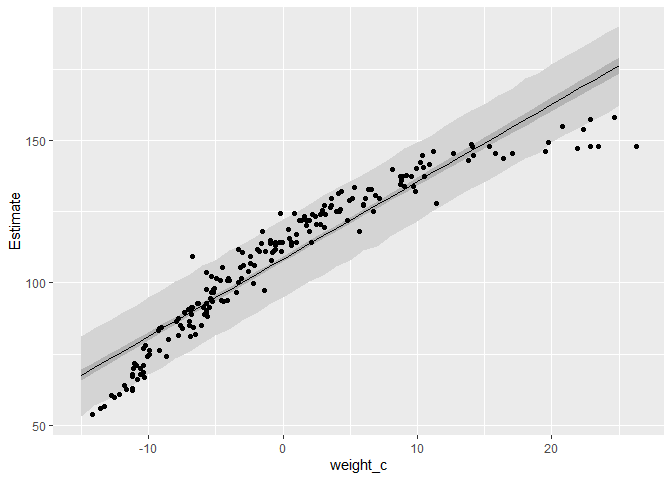
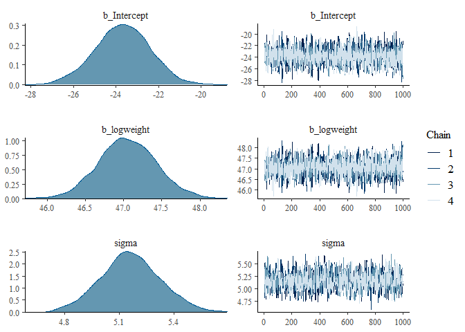
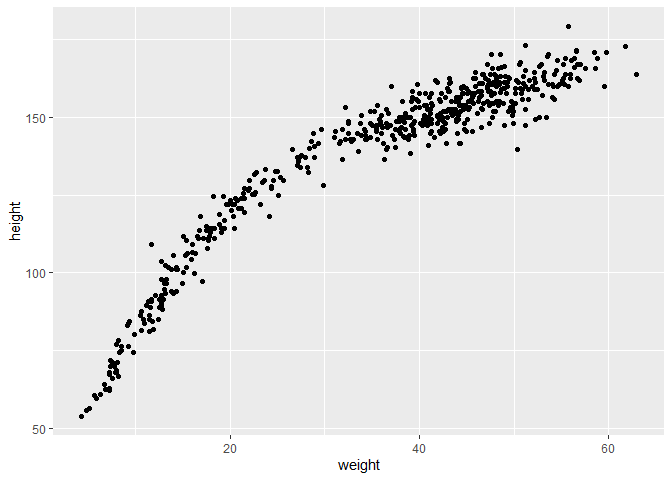
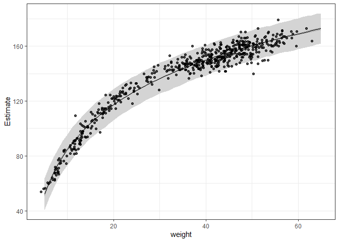
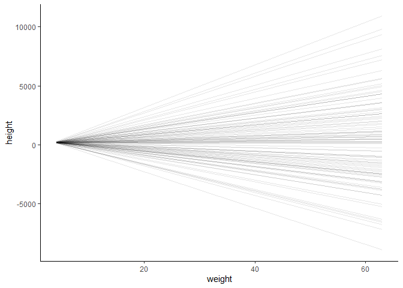
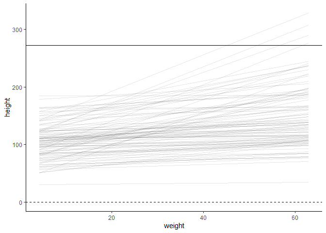

chp4
================
Vasco Brazão
12/23/2020

## Packages & Data

``` r
library(tidyverse)
```

    ## -- Attaching packages --------------------------------------- tidyverse 1.3.0 --

    ## v ggplot2 3.3.2     v purrr   0.3.4
    ## v tibble  3.0.4     v dplyr   1.0.2
    ## v tidyr   1.1.2     v stringr 1.4.0
    ## v readr   1.4.0     v forcats 0.5.0

    ## -- Conflicts ------------------------------------------ tidyverse_conflicts() --
    ## x dplyr::filter() masks stats::filter()
    ## x dplyr::lag()    masks stats::lag()

``` r
library(here)
```

    ## here() starts at C:/Users/admin/Documents/statistical-rethinking

``` r
library(tinytex)
library(rethinking)
```

    ## Loading required package: rstan

    ## Loading required package: StanHeaders

    ## rstan (Version 2.21.2, GitRev: 2e1f913d3ca3)

    ## For execution on a local, multicore CPU with excess RAM we recommend calling
    ## options(mc.cores = parallel::detectCores()).
    ## To avoid recompilation of unchanged Stan programs, we recommend calling
    ## rstan_options(auto_write = TRUE)

    ## Do not specify '-march=native' in 'LOCAL_CPPFLAGS' or a Makevars file

    ## 
    ## Attaching package: 'rstan'

    ## The following object is masked from 'package:tidyr':
    ## 
    ##     extract

    ## Loading required package: parallel

    ## rethinking (Version 2.13)

    ## 
    ## Attaching package: 'rethinking'

    ## The following object is masked from 'package:purrr':
    ## 
    ##     map

    ## The following object is masked from 'package:stats':
    ## 
    ##     rstudent

``` r
data(Howell1)

d <- Howell1

rm(Howell1)
detach(package:rethinking, unload = T)
library(brms)
```

    ## Loading required package: Rcpp

    ## Loading 'brms' package (version 2.14.4). Useful instructions
    ## can be found by typing help('brms'). A more detailed introduction
    ## to the package is available through vignette('brms_overview').

    ## 
    ## Attaching package: 'brms'

    ## The following object is masked from 'package:rstan':
    ## 
    ##     loo

    ## The following object is masked from 'package:stats':
    ## 
    ##     ar

## 4E1

The first line is the likelihood, the two others lines are the priors
for mu and sigma.

## 4E2

2 parameters, mu and sigma

## 4E3

Oh god. Still need to learn how to format things so…

Pr(mu, sigma\|y\_i) = PRODUCT\_i(Normal(y\_i\|mu, sigma) \*
Normal(mu\|0, 10) \* Exponential(sigma\|1) /
DOUBLE\_INTEGRAL(PRODUCT\_i(Normal(y\_i\|mu, sigma) \* Normal(mu\|0, 10)
\* Exponential(sigma\|1) )) dmu dsigma

Happy?

## 4E4

The second line is the linear model.

## 4E5

There are three parameters: alpha, beta, and sigma.

## 4M1

``` r
N <- 100000

y_values <- tibble(
  mu = rnorm(N, 0, 10),
  sigma = rexp(N, 1),
  y = rnorm(N, mean = mu, sd = sigma)
)


hist(y_values$y, breaks = 1000)
```

<!-- -->

## 4M2

As I’m using `brms`, and trying to learn how to use it at the same time,
I’ll skip the `quap` stuff and jump straight into `brms`.

``` r
#this is what it maybe would look like in brms. hell if I know

b4m1 <- brm(data = y_values,
            family = gaussian,
            y ~ 1,
            prior = c(prior(normal(0, 10), class = Intercept),
                      prior(exponential(1), class = sigma)),
            iter = 2000, warmup = 1000, chains = 4, cores = 4,
            seed = 4,
            file = here("b4m1")
)
```

``` r
plot(b4m1)
```

<!-- -->

## 4M4

$$
\\begin{align\*}
\\text{height}\_i & \\sim \\operatorname{Normal}(\\mu\_i, \\sigma) \\\\
\\mu\_i  & = \\alpha + \\beta \\times (\\text{year}\_i - 2) \\\\
\\alpha & \\sim \\operatorname{Normal}(160, 10) \\\\
\\beta  & \\sim \\operatorname{Normal}(0, 5) \\\\
\\sigma & \\sim \\operatorname{Exponential}(1/10) \\\\
\\end{align\*}
$$

## 4M5

Of course, I almost forgot!

$$
\\begin{align\*}
\\text{height}\_i & \\sim \\operatorname{Normal}(\\mu\_i, \\sigma) \\\\
\\mu\_i  & = \\alpha + \\beta \\times (\\text{year}\_i - 2) \\\\
\\alpha & \\sim \\operatorname{Normal}(140, 20) \\\\
\\beta  & \\sim \\operatorname{Log-Normal}(0, 5) \\\\
\\sigma & \\sim \\operatorname{Exponential}(1/10) \\\\
\\end{align\*}
$$

## 4M6

Assuming also that our sample has kids of roughly the same age, we can
adjust the prior for the variance. But not sure this one makes sense?

$$
\\begin{align\*}
\\text{height}\_i & \\sim \\operatorname{Normal}(\\mu\_i, \\sigma) \\\\
\\mu\_i  & = \\alpha + \\beta \\times (\\text{year}\_i - 2) \\\\
\\alpha & \\sim \\operatorname{Normal}(140, 32) \\\\
\\beta  & \\sim \\operatorname{Log-Normal}(0, 5) \\\\
\\sigma & \\sim \\operatorname{Exponential}(1/32)
\\end{align\*}
$$

## 4M7

``` r
d2 <- d %>%
  filter(age >= 18)

b4.3 <- 
  brm(data = d2, 
      family = gaussian,
      height ~ 1 + weight,
      prior = c(prior(normal(178, 20), class = Intercept),
                prior(lognormal(0, 1), class = b),
                prior(uniform(0, 50), class = sigma)),
      iter = 28000, warmup = 27000, chains = 4, cores = 4,
      seed = 4,
      file = "b04.03")
```

So brms has some warnings and I’m not sure I need to care about them?

``` r
plot(b4.3)
```

<!-- -->

``` r
posterior_summary(b4.3)[1:3, ] %>% 
  round(digits = 2)
```

    ##             Estimate Est.Error   Q2.5  Q97.5
    ## b_Intercept   113.85      1.94 109.94 117.63
    ## b_weight        0.91      0.04   0.82   0.99
    ## sigma           5.10      0.19   4.74   5.48

So, to compare with the fit where weight was centered:

-   the estimate for b\_intercept is lower for my model (by around
    41kg), and the error is almost 7 times higher.
-   the estimate for beta is almost exactly the same
-   the estimate for sigma is almost exactly the same

``` r
vcov(b4.3) %>%
  round(3)
```

    ##           Intercept weight
    ## Intercept     3.768 -0.082
    ## weight       -0.082  0.002

Now, though, the variance of the intercept is way larger than before,
and the covariance with weight is slightly negative (vs 0)

To get sigma as well:

``` r
posterior_samples(b4.3) %>%
  select(-lp__) %>%
  cov() %>%
  round(digits = 3)
```

    ##             b_Intercept b_weight sigma
    ## b_Intercept       3.768   -0.082 0.003
    ## b_weight         -0.082    0.002 0.000
    ## sigma             0.003    0.000 0.037

Posterior against the data:

``` r
d2 %>%
  ggplot(aes(x = weight, y = height)) +
  geom_abline(intercept = fixef(b4.3)[1], 
              slope     = fixef(b4.3)[2]) +
  geom_point(shape = 1, size = 2, color = "royalblue") +
  theme_classic()
```

<!-- -->

Making posterior predictions:

``` r
weight_seq <- 
  tibble(weight = 25:70)

mu_summary <-
  fitted(b4.3, 
         newdata = weight_seq) %>%
  data.frame() %>%
  bind_cols(weight_seq)

pred_height <-
  predict(b4.3,
          newdata = weight_seq) %>%
  data.frame() %>%
  bind_cols(weight_seq)

d2 %>%
  ggplot(aes(x = weight)) +
  geom_ribbon(data = pred_height, 
              aes(ymin = Q2.5, ymax = Q97.5),
              fill = "grey83") +
  geom_smooth(data = mu_summary,
              aes(y = Estimate, ymin = Q2.5, ymax = Q97.5),
              stat = "identity",
              fill = "grey70", color = "black", alpha = 1, size = 1/2) +
  geom_point(aes(y = height),
             color = "navyblue", shape = 1, size = 1.5, alpha = 2/3) +
  coord_cartesian(xlim = range(d2$weight),
                  ylim = range(d2$height)) +
  theme(panel.grid = element_blank())
```

<!-- --> They look
exactly the same?

## 4M8

First, I want to fit the same model as in the chapter. Need to get the
data first.

(Upon second thought: I will skip the exercises with splines for now. I
want to understand brms better before I come back to this. So for now
I’ll do only H1 to H4.)

``` r
#detach(package:brms, unload = T)
#library(rethinking)
#
#data(cherry_blossoms)
#d <- cherry_blossoms
#rm(cherry_blossoms)
#
#d2 <- d %>%
#  tidyr::drop_na(doy)
```

## 4H1

First, let’s just make a dataset with our weights

``` r
new_kung <- tibble(
  id = 1:5,
  weight = c(46.95, 43.72, 64.78, 32.59, 54.63)
)
```

I’m working with the same priors as the brms implementation, section
4.4.2. I hope to become confident enough to set my own priors soon…

$$
\\begin{align\*}
\\text{height}\_i & \\sim \\operatorname{Normal}(\\mu\_i, \\sigma) \\\\
\\mu\_i  & = \\alpha + \\beta \\times (\\text{weight}\_i - \\bar{weight}) \\\\
\\alpha & \\sim \\operatorname{Normal}(178, 20) \\\\
\\beta  & \\sim \\operatorname{Log-Normal}(0, 1) \\\\
\\sigma & \\sim \\operatorname{Uniform}(0, 50) \\\\
\\end{align\*}
$$

``` r
d2 <-
  d2 %>% 
  mutate(weight_c = weight - mean(weight))

# formula from brms implementation, section 4.4.2
b4.3 <- 
  brm(data = d2, 
      family = gaussian,
      height ~ 1 + weight_c,
      prior = c(prior(normal(178, 20), class = Intercept),
                prior(lognormal(0, 1), class = b),
                prior(uniform(0, 50), class = sigma)),
      iter = 28000, warmup = 27000, chains = 4, cores = 4,
      seed = 4,
      file = "fits/b04.03")
```

``` r
new_kung <- new_kung %>%
  mutate(
    weight_c = weight - mean(d2$weight)
  )

mu <-
  fitted(b4.3,
         summary = F,
         newdata = new_kung) %>%
  data.frame() %>%
  set_names(new_kung$weight) %>%
  mutate(iter = 1:n()) %>%
  pivot_longer(-iter,
               names_to = "weight",
               values_to = "height") %>%
  mutate(weight = as.numeric(weight))

pred_height <-
  predict(b4.3,
          newdata = new_kung,
          probs = c(.055, .945)) %>%
  data.frame() %>%
  bind_cols(new_kung)

pred_height
```

    ##   Estimate Est.Error     Q5.5    Q94.5 id weight   weight_c
    ## 1 156.4268  5.147430 148.0091 164.5340  1  46.95   1.959514
    ## 2 153.3439  5.137326 145.0565 161.6468  2  43.72  -1.270486
    ## 3 172.4327  5.303660 164.1710 181.0830  3  64.78  19.789514
    ## 4 143.4828  5.166695 135.2289 151.9437  4  32.59 -12.400486
    ## 5 163.2677  5.171053 154.9979 171.4670  5  54.63   9.639514

`pred_height` has what we need! Estimate = expected height; and the
bounds of the 89% interval are in the Q5.5. and Q94.5 columns.

## 4H2

``` r
d3 <- d %>%
  filter(age < 18)
```

`d3` has 192 observations, so far so good.

``` r
d3 <- d3 %>%
  mutate(
    weight_c = weight - mean(d3$weight)
  )


b4h2 <- 
  brm(data = d3, 
      family = gaussian,
      height ~ 1 + weight_c,
      prior = c(prior(normal(100, 50), class = Intercept),
                prior(lognormal(0, 1), class = b),
                prior(uniform(0, 50), class = sigma)),
      iter = 28000, warmup = 27000, chains = 4, cores = 4,
      seed = 4,
      file = "fits/b4h2")
```

``` r
summary(b4h2)
```

    ##  Family: gaussian 
    ##   Links: mu = identity; sigma = identity 
    ## Formula: height ~ 1 + weight_c 
    ##    Data: d3 (Number of observations: 192) 
    ## Samples: 4 chains, each with iter = 28000; warmup = 27000; thin = 1;
    ##          total post-warmup samples = 4000
    ## 
    ## Population-Level Effects: 
    ##           Estimate Est.Error l-95% CI u-95% CI Rhat Bulk_ESS Tail_ESS
    ## Intercept   108.32      0.61   107.12   109.50 1.00     4845     3025
    ## weight_c      2.72      0.07     2.58     2.86 1.00     4964     3090
    ## 
    ## Family Specific Parameters: 
    ##       Estimate Est.Error l-95% CI u-95% CI Rhat Bulk_ESS Tail_ESS
    ## sigma     8.55      0.45     7.73     9.50 1.00     4983     3043
    ## 
    ## Samples were drawn using sampling(NUTS). For each parameter, Bulk_ESS
    ## and Tail_ESS are effective sample size measures, and Rhat is the potential
    ## scale reduction factor on split chains (at convergence, Rhat = 1).

1.  From what I understand, this means the model expects a 2.72cm
    increase in height for every extra kg of weight.

``` r
d3 %>%
  ggplot(aes(x = weight_c, y = height)) +
  geom_abline(intercept = fixef(b4h2)[1], 
              slope     = fixef(b4h2)[2]) +
  geom_point()
```

<!-- -->

``` r
weight_c_seq <- 
  tibble(weight_c = -15:25)

mu_summary <-
  fitted(b4h2, 
         newdata = weight_c_seq,
         probs = c(0.055, 0.945)) %>%
  data.frame() %>%
  bind_cols(weight_c_seq)

pred_height <-
  predict(b4h2,
          newdata = weight_c_seq,
          probs = c(0.055, 0.945)) %>%
  data.frame() %>%
  bind_cols(weight_c_seq)

d3 %>%
  ggplot(aes(x = weight_c))  + 
  geom_ribbon(data = pred_height, 
              aes(y = Estimate, ymin = Q5.5, ymax = Q94.5),
              fill = "grey83") +
  geom_smooth(data = mu_summary,
              aes(y = Estimate, ymin = Q5.5, ymax = Q94.5),
              stat = "identity",
              fill = "grey70", color = "black", alpha = 1, size = 1/2) +
  geom_point(aes(y = height))
```

<!-- --> (c) It seems the model is
poor over all, but poorest around the edges: it overestimates height
both for low and for high weight.

## 4H3

Ok, so we shall now model height as dependent upon the log of weight.

A bit like…

$$
\\begin{align\*}
\\text{height}\_i & \\sim \\operatorname{Normal}(\\mu\_i, \\sigma) \\\\
\\mu\_i  & = \\alpha + \\beta \\times \\operatorname{Log}(\\text{weight}\_i) \\\\
\\alpha & \\sim \\operatorname{Normal}(178, 20) \\\\
\\beta  & \\sim \\operatorname{Log-Normal}(0, 1) \\\\
\\sigma & \\sim \\operatorname{Uniform}(0, 50) \\\\
\\end{align\*}
$$

?

And how does that look in brms?

``` r
b4h3 <- 
  brm(data = d, 
      family = gaussian,
      height ~ 1 + log(weight),
      prior = c(prior(normal(100, 50), class = Intercept),
                prior(lognormal(0, 1), class = b),
                prior(uniform(0, 50), class = sigma)),
      iter = 28000, warmup = 27000, chains = 4, cores = 4,
      seed = 4,
      file = "fits/b4h3.correct")
```

``` r
plot(b4h3)
```

<!-- -->

``` r
summary(b4h3)
```

    ##  Family: gaussian 
    ##   Links: mu = identity; sigma = identity 
    ## Formula: height ~ 1 + log(weight) 
    ##    Data: d (Number of observations: 544) 
    ## Samples: 4 chains, each with iter = 28000; warmup = 27000; thin = 1;
    ##          total post-warmup samples = 4000
    ## 
    ## Population-Level Effects: 
    ##           Estimate Est.Error l-95% CI u-95% CI Rhat Bulk_ESS Tail_ESS
    ## Intercept   -23.69      1.32   -26.33   -21.17 1.00     2084     2156
    ## logweight    47.05      0.38    46.31    47.82 1.00     2068     2107
    ## 
    ## Family Specific Parameters: 
    ##       Estimate Est.Error l-95% CI u-95% CI Rhat Bulk_ESS Tail_ESS
    ## sigma     5.16      0.16     4.84     5.49 1.00     1291     1450
    ## 
    ## Samples were drawn using sampling(NUTS). For each parameter, Bulk_ESS
    ## and Tail_ESS are effective sample size measures, and Rhat is the potential
    ## scale reduction factor on split chains (at convergence, Rhat = 1).

Not sure I can interpret the parameters tbh.

``` r
d %>%
  ggplot(aes(x = weight)) +
  geom_point(aes(y = height))
```

<!-- -->

``` r
new_weight <- tibble(
  weight = 5:65
)

mu_summary <-
  fitted(b4h3, 
         newdata = new_weight,
         probs = c(0.015, 0.985)) %>%
  data.frame() %>%
  bind_cols(new_weight)

pred_height <-
  predict(b4h3,
          newdata = new_weight,
          probs = c(0.015, 0.985)) %>%
  data.frame() %>%
  bind_cols(new_weight)


d %>% ggplot(aes(x = weight)) +
  geom_ribbon(data = pred_height, 
              aes(y = Estimate, ymin = Q1.5, ymax = Q98.5),
              fill = "grey83") +
  geom_smooth(data = mu_summary,
              aes(y = Estimate, ymin = Q1.5, ymax = Q98.5),
              stat = "identity",
              fill = "grey70", color = "black", alpha = 1, size = 1/2) +
  geom_point(data = d, aes(y = height), alpha = .7) +
  theme_bw()
```

<!-- -->

## 4H4

The model in chapter was:

h\_i = Normal(mu\_i, sigma)

mu\_i = alpha + b\_1 \* x\_i, b\_2 \* x\_i^2

alpha = normal(178,20) b\_1 = Log-Normal(0,1) b\_2 = Normal(0,1) sigma =
uniform(0,50)

x\_i is the weight of the individual.

``` r
n_lines <- 100

lines <- 
  tibble(n = 1:n_lines,
         a = rnorm(n_lines, mean = 178, sd = 20),
         b1 = rlnorm(n_lines, meanlog = 0, sdlog = 1),
         b2 = rnorm(n_lines, mean = 0, sd = 1)) %>%
  expand(nesting(n, a, b1, b2), weight = range(d$weight)) %>%
  mutate(height = a + b1 * weight + b2 * weight ^ 2)

lines %>%
  ggplot(aes(x = weight, y = height, group = n)) +
  geom_line(alpha = 1/10) +
  theme_classic()
```

<!-- --> Ok.

I feel like the lines should curve? Either way, time to try to make the
model more plausible. E.g…. there cannot be negative mean heights, and
they probably shouldn’t go as far up as many thousand cm …

``` r
n_lines <- 100

lines <- 
  tibble(n = 1:n_lines,
         a = rnorm(n_lines, mean = 100, sd = 30),
         b1 = rlnorm(n_lines, meanlog = -5, sdlog = 1),
         b2 = rexp(n_lines, rate = 100)) %>%
  expand(nesting(n, a, b1, b2), weight = range(d$weight)) %>%
  mutate(height = a + b1 * weight + b2 * weight ^ 2)

lines %>%
  ggplot(aes(x = weight, y = height, group = n)) +
  geom_hline(yintercept = c(0, 272), linetype = 2:1, size = 1/3) +
  geom_line(alpha = 1/10) +
  theme_classic()
```

<!-- --> Ok, I am sort of
happy with this.

But I have lingering doubts… shouldn’t the lines be curves?
