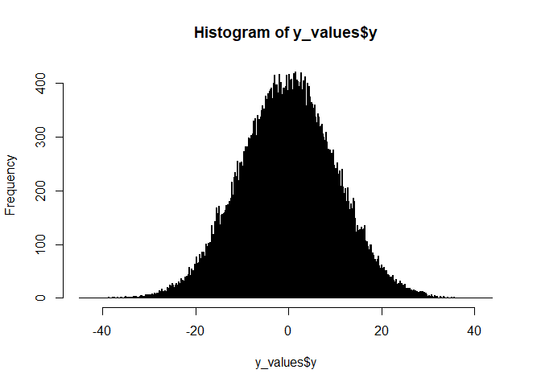
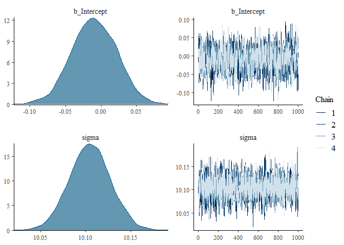

chp4
================
Vasco Brazão
12/23/2020

## Packages

``` r
library(tidyverse)
```

    ## -- Attaching packages --------------------------------------- tidyverse 1.3.0 --

    ## v ggplot2 3.3.2     v purrr   0.3.4
    ## v tibble  3.0.4     v dplyr   1.0.2
    ## v tidyr   1.1.2     v stringr 1.4.0
    ## v readr   1.4.0     v forcats 0.5.0

    ## -- Conflicts ------------------------------------------ tidyverse_conflicts() --
    ## x dplyr::filter() masks stats::filter()
    ## x dplyr::lag()    masks stats::lag()

``` r
library(brms)
```

    ## Loading required package: Rcpp

    ## Loading 'brms' package (version 2.14.4). Useful instructions
    ## can be found by typing help('brms'). A more detailed introduction
    ## to the package is available through vignette('brms_overview').

    ## 
    ## Attaching package: 'brms'

    ## The following object is masked from 'package:stats':
    ## 
    ##     ar

``` r
library(here)
```

    ## here() starts at C:/Users/admin/Documents/statistical-rethinking

``` r
library(tinytex)
```

## 4E1

The first line is the likelihood, the two others lines are the priors
for mu and sigma.

## 4E2

2 parameters, mu and sigma

## 4E3

Oh god. Still need to learn how to format things so…

Pr(mu, sigma\|y\_i) = PRODUCT\_i(Normal(y\_i\|mu, sigma) \*
Normal(mu\|0, 10) \* Exponential(sigma\|1) /
DOUBLE\_INTEGRAL(PRODUCT\_i(Normal(y\_i\|mu, sigma) \* Normal(mu\|0, 10)
\* Exponential(sigma\|1) )) dmu dsigma

Happy?

## 4E4

The second line is the linear model.

## 4E5

There are three parameters: alpha, beta, and sigma.

## 4M1

``` r
N <- 100000

y_values <- tibble(
  mu = rnorm(N, 0, 10),
  sigma = rexp(N, 1),
  y = rnorm(N, mean = mu, sd = sigma)
)


hist(y_values$y, breaks = 1000)
```

<!-- -->

## 4M2

As I’m using `brms`, and trying to learn how to use it at the same time,
I’ll skip the `quap` stuff and jump straight into `brms`.

``` r
#this is what it maybe would look like in brms. hell if I know

b4m1 <- brm(data = y_values,
            family = gaussian,
            y ~ 1,
            prior = c(prior(normal(0, 10), class = Intercept),
                      prior(exponential(1), class = sigma)),
            iter = 2000, warmup = 1000, chains = 4, cores = 4,
            seed = 4,
            file = here("b4m1")
)
```

``` r
plot(b4m1)
```

<!-- -->

## 4M4

$$
\\begin{align\*}
\\text{height}\_i & \\sim \\operatorname{Normal}(\\mu\_i, \\sigma) \\\\
\\mu\_i  & = \\alpha + \\beta \\times (\\text{year}\_i - 2) \\\\
\\alpha & \\sim \\operatorname{Normal}(160, 10) \\\\
\\beta  & \\sim \\operatorname{Normal}(0, 5) \\\\
\\sigma & \\sim \\operatorname{Exponential}(1/10) \\\\
\\end{align\*}
$$

## 4M5

Of course, I almost forgot!

$$
\\begin{align\*}
\\text{height}\_i & \\sim \\operatorname{Normal}(\\mu\_i, \\sigma) \\\\
\\mu\_i  & = \\alpha + \\beta \\times (\\text{year}\_i - 2) \\\\
\\alpha & \\sim \\operatorname{Normal}(140, 20) \\\\
\\beta  & \\sim \\operatorname{Log-Normal}(0, 5) \\\\
\\sigma & \\sim \\operatorname{Exponential}(1/10) \\\\
\\end{align\*}
$$

## 4M6

Assuming also that our sample has kids of roughly the same age, we can
adjust the prior for the variance. But not sure this one makes sense?

$$\\text{height}\_i & \\sim \\operatorname{Normal}(\\mu\_i, \\sigma) \\\\
\\mu\_i  & = \\alpha + \\beta \\times (\\text{year}\_i - 2) \\\\
\\alpha & \\sim \\operatorname{Normal}(140, 32) \\\\
\\beta  & \\sim \\operatorname{Log-Normal}(0, 5) \\\\
\\sigma & \\sim \\operatorname{Exponential}(1/32)$$
